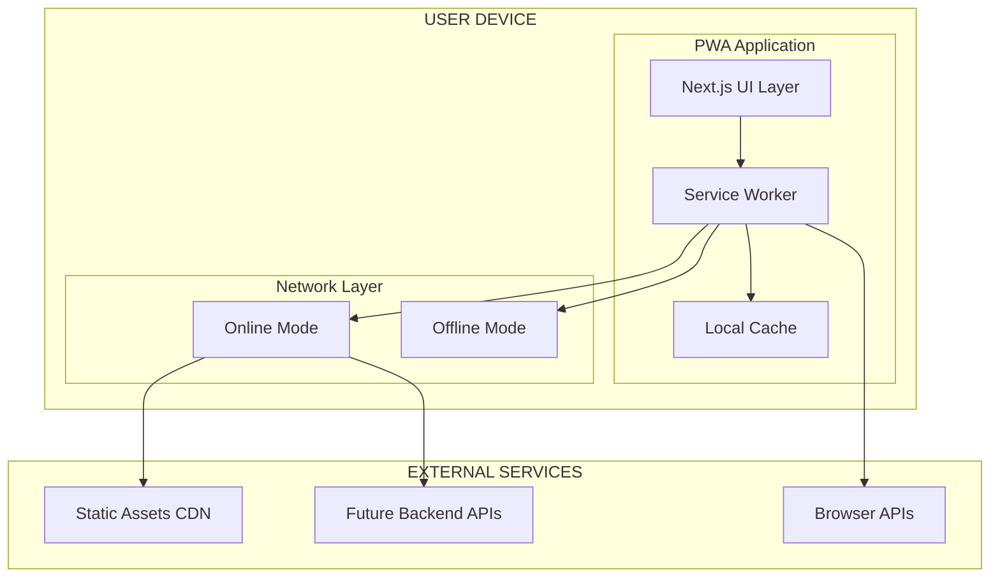
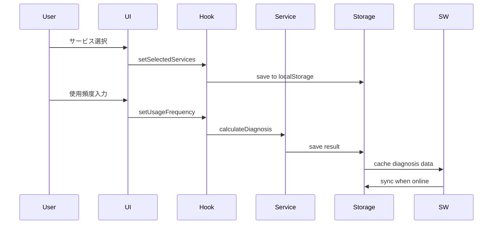
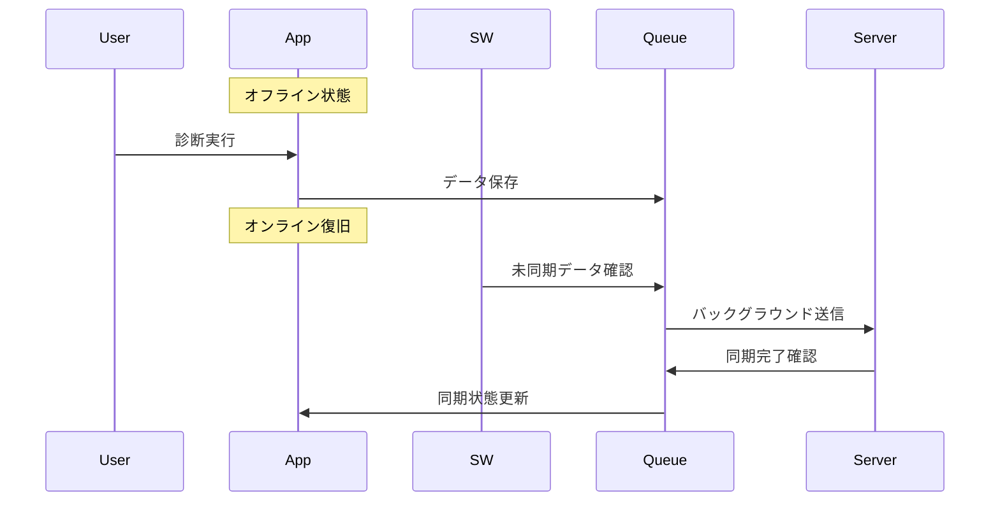

# SubCheck PWA アーキテクチャ設計書

## 📋 文書情報

- **プロジェクト**: SubCheck - サブスク診断PWA
- **文書種別**: 技術設計書
- **作成日**: 2025-11-09
- **最終更新**: 2025-11-09
- **対象**: 開発チーム、技術レビューアー

---

## 🎯 概要

SubCheckは、ユーザーのサブスクリプション利用状況を診断し、無駄遣いを可視化するProgressive Web Application (PWA)です。オフライン機能を重視し、いつでもどこでも診断できる環境を提供します。

### 主要目標

- **アクセシビリティ**: アプリストア不要でインストール可能
- **オフライン優先**: 通信環境に依存しない診断機能
- **高速性**: キャッシュ戦略による瞬間的なロード
- **クロスプラットフォーム**: 単一コードベースで全デバイス対応

---

## 🏗️ システム全体アーキテクチャ



---

## 📁 プロジェクト構成

### ディレクトリ構造

```
/
├── app/                          # Next.js App Router
│   ├── layout.tsx                # ルートレイアウト
│   ├── page.tsx                  # ホームページ
│   ├── offline/page.tsx          # オフライン専用ページ
│   └── diagnosis/                # 診断フロー
│       ├── select/page.tsx       # サービス選択
│       ├── usage/page.tsx        # 使用頻度入力
│       └── results/page.tsx      # 診断結果表示
│
├── components/                   # Reactコンポーネント
│   ├── ui/                       # 基本UIコンポーネント
│   │   ├── button.tsx
│   │   ├── LoadingSpinner.tsx
│   │   └── OfflineIndicator.tsx  # オフライン状態表示
│   ├── shared/                   # 共通機能コンポーネント
│   │   ├── AlertsContainer.tsx   # アラート表示
│   │   ├── ResultsSummary.tsx    # 診断結果サマリー
│   │   └── SocialShareButtons.tsx
│   ├── forms/                    # フォーム関連
│   │   ├── SubscriptionSelector.tsx
│   │   └── UsageFrequencySelector.tsx
│   ├── charts/                   # データ可視化
│   │   └── WasteChart.tsx        # 無駄遣いチャート
│   └── pwa/                      # PWA専用コンポーネント
│       ├── InstallPrompt.tsx     # インストール促進UI
│       └── ServiceWorkerRegistration.tsx
│
├── lib/                          # ビジネスロジック層
│   ├── hooks/                    # カスタムフック
│   │   ├── useDiagnosisSession.ts # 診断セッション管理
│   │   └── useOfflineSync.ts     # オフライン同期機能
│   ├── services/                 # ビジネスサービス
│   │   ├── SubscriptionService.ts # サブスク業務ロジック
│   │   ├── CalculationService.ts # 診断計算エンジン
│   │   ├── AlertService.ts       # アラート生成・管理
│   │   └── SharingService.ts     # SNSシェア機能
│   ├── storage/                  # データ永続化
│   │   └── StorageService.ts     # LocalStorage抽象化
│   ├── calculations/             # 計算ロジック
│   │   ├── CalculationService.ts # メイン計算処理
│   │   └── constants.ts          # 計算定数
│   └── data/                     # 静的データ
│       └── subscriptions.ts      # サブスクマスタデータ
│
├── public/                       # 静的アセット
│   ├── sw.js                     # Service Worker
│   ├── manifest.json             # PWAマニフェスト
│   ├── icons/                    # アプリアイコン各サイズ
│   └── screenshots/              # アプリスクリーンショット
│
└── types/                        # TypeScript型定義
    ├── index.ts                  # 型定義エクスポート
    ├── subscription.ts           # サブスク関連型
    └── diagnosis.ts              # 診断結果関連型
```

---

## 🔧 レイヤー別詳細設計

### 1. プレゼンテーション層（UI Layer）

#### Next.js App Router設計

```typescript
// app/layout.tsx - ルートレイアウト
export const metadata: Metadata = {
  title: "SubCheck - サブスク無駄率診断",
  manifest: "/manifest.json",
  themeColor: "#2563eb",
  appleWebApp: { capable: true, title: "SubCheck" }
};

// PWA必須コンポーネント統合
export default function RootLayout({ children }: { children: React.ReactNode }) {
  return (
    <html lang="ja">
      <body>
        <ServiceWorkerRegistration />  // SW登録
        <OfflineIndicator />           // 接続状態表示
        <ErrorBoundary>
          {children}
        </ErrorBoundary>
      </body>
    </html>
  );
}
```

#### コンポーネント設計原則

- **単一責任**: 各コンポーネントは一つの機能に集中
- **再利用性**: 共通UIコンポーネントの統一
- **アクセシビリティ**: ARIA属性とキーボードナビゲーション
- **国際化対応**: 日本語最適化（将来多言語対応可能）

### 2. ビジネスロジック層（Business Logic Layer）

#### カスタムフック設計

```typescript
// useDiagnosisSession.ts - 診断セッション管理
export function useDiagnosisSession() {
  return {
    // 状態管理
    selectedServices: string[];
    usageFrequencies: Record<string, UsageFrequency>;
    diagnosisResult: DiagnosisResult | null;
    
    // 操作関数
    setSelectedServices: (services: string[]) => void;
    setUsageFrequency: (serviceId: string, frequency: UsageFrequency) => void;
    calculateResults: () => void;
    clearSession: () => void;
    
    // 計算状態
    hasSelectedServices: boolean;
    hasAllFrequencies: boolean;
    currentStep: "select" | "usage" | "results";
  };
}

// useOfflineSync.ts - オフライン同期
export function useOfflineSync() {
  return {
    isOnline: boolean;
    pendingSync: OfflineData[];
    isSyncing: boolean;
    queueForSync: (data: DiagnosisResult) => string;
    triggerSync: () => void;
    clearPendingData: () => void;
  };
}
```

#### サービス層設計

```typescript
// SubscriptionService.ts - サブスク業務ロジック
export class SubscriptionService {
  static async getAllSubscriptions(): Promise<Subscription[]>;
  static async getSubscriptionById(id: string): Promise<Subscription | null>;
  static validateCustomSubscription(data: CustomSubscriptionInput): ValidationResult;
}

// CalculationService.ts - 診断計算エンジン  
export function calculateDiagnosis(
  userSubscriptions: UserSubscription[],
  allSubscriptions: Subscription[]
): DiagnosisResult {
  // 使用頻度別計算
  // 無駄率計算
  // 年間節約額計算
  // カテゴリ別分析
}
```

### 3. データ層（Data Layer）

#### ストレージ戦略

```typescript
// StorageService.ts - 統一データアクセス層
interface StorageInterface {
  // 診断関連
  saveSelectedSubscriptions(services: string[]): void;
  getSelectedSubscriptions(): string[];
  saveDiagnosisResult(result: DiagnosisResult): void;
  getDiagnosisResult(): DiagnosisResult | null;
  getDiagnosisHistory(): DiagnosisResult[];
  
  // ユーザー設定
  saveUserSettings(settings: UserSettings): void;
  getUserSettings(): UserSettings;
  
  // アラート管理
  saveAlert(alert: AlertNotification): void;
  getAlerts(): AlertNotification[];
  
  // エラーハンドリング
  clearAllData(): void;
  validateStorage(): boolean;
}
```

#### データ構造設計

```typescript
// 診断結果
interface DiagnosisResult {
  id: string;
  createdAt: string;
  subscriptions: SubscriptionUsage[];
  totals: {
    monthly: number;
    yearly: number;
    usedYearly: number;
    unusedYearly: number;
  };
  wasteRate: number;
  breakdown: UsageBreakdown;
  insights: string[];
}

// オフライン同期データ
interface OfflineData {
  id: string;
  timestamp: number;
  data: DiagnosisResult;
  synced: boolean;
}
```

---

## ⚡ Service Worker設計

### アーキテクチャ

```javascript
// /public/sw.js
const STATIC_CACHE_NAME = 'subcheck-static-v1';
const RUNTIME_CACHE_NAME = 'subcheck-runtime-v1';

// キャッシュ戦略パターン
const CACHE_STRATEGIES = {
  // 静的アセット: Cache First
  CACHE_FIRST_PATTERNS: [
    /\/_next\/static\//,     // Next.js静的ファイル
    /\/icons\//,             // アプリアイコン
    /\.(?:css|js|woff2?|png|jpg|webp|svg|ico)$/
  ],
  
  // API通信: Network First
  NETWORK_FIRST_PATTERNS: [
    /\/api\//,
    /\/diagnosis\/api\//
  ],
  
  // ページ: Stale While Revalidate
  // その他すべて
};
```

### ライフサイクル管理

```javascript
// インストール時
self.addEventListener('install', (event) => {
  event.waitUntil(
    caches.open(STATIC_CACHE_NAME)
      .then(cache => cache.addAll(STATIC_ASSETS))
  );
  self.skipWaiting();
});

// アクティベーション時
self.addEventListener('activate', (event) => {
  event.waitUntil(
    caches.keys().then(cacheNames => {
      return Promise.all(
        cacheNames.map(cacheName => {
          if (cacheName !== STATIC_CACHE_NAME && 
              cacheName !== RUNTIME_CACHE_NAME &&
              cacheName.startsWith('subcheck-')) {
            return caches.delete(cacheName);
          }
        })
      );
    })
  );
  self.clients.claim();
});
```

### バックグラウンド機能

```javascript
// 診断データ同期
self.addEventListener('sync', (event) => {
  if (event.tag === 'diagnosis-sync') {
    event.waitUntil(syncDiagnosisData());
  }
});

// プッシュ通知（将来機能）
self.addEventListener('push', (event) => {
  const data = event.data?.json() || {};
  event.waitUntil(
    self.registration.showNotification(data.title, {
      body: data.body,
      icon: '/icons/icon-192x192.png',
      actions: [
        { action: 'view', title: '確認' },
        { action: 'dismiss', title: '閉じる' }
      ]
    })
  );
});
```

---

## 📱 PWA実装仕様

### マニフェスト設計

```json
{
  "name": "SubCheck - サブスク使ってる？診断",
  "short_name": "SubCheck",
  "description": "サブスクリプション利用状況を診断して、年間の無駄遣いを可視化",
  "start_url": "/",
  "scope": "/",
  "display": "standalone",
  "orientation": "portrait-primary",
  "background_color": "#ffffff",
  "theme_color": "#2563eb",
  "lang": "ja",
  
  "icons": [
    {
      "src": "/icons/icon-72x72.png",
      "sizes": "72x72",
      "type": "image/png",
      "purpose": "maskable any"
    }
    // ... 複数サイズ対応
  ],
  
  "shortcuts": [
    {
      "name": "新しい診断",
      "description": "新しいサブスク診断を開始",
      "url": "/diagnosis/select",
      "icons": [{"src": "/icons/shortcut-diagnosis.png", "sizes": "96x96"}]
    },
    {
      "name": "前回の結果",
      "description": "前回の診断結果を確認", 
      "url": "/diagnosis/results"
    },
    {
      "name": "設定",
      "description": "アラート設定とカスタマイズ",
      "url": "/settings"
    }
  ],
  
  "categories": ["finance", "lifestyle", "productivity"]
}
```

### インストール戦略

```typescript
// InstallPrompt.tsx
export default function InstallPrompt() {
  const [isIOS] = useState(() => /iPad|iPhone|iPod/.test(navigator.userAgent));
  const [isStandalone] = useState(() => 
    window.matchMedia('(display-mode: standalone)').matches
  );

  // プラットフォーム別対応
  if (isIOS && !isStandalone) {
    return <IOSInstallInstructions />;
  }
  
  if (deferredPrompt) {
    return <ChromeInstallPrompt />;
  }
  
  return null;
}
```

---

## 🔄 データフロー設計

### 診断フロー



### オフライン同期フロー



---

## 🎨 UX/UI設計原則

### レスポンシブ設計

```css
/* モバイルファースト設計 */
.container {
  /* Mobile (< 768px) */
  padding: 16px;
  grid-template-columns: 1fr;
}

@media (min-width: 768px) {
  /* Tablet */
  .container {
    padding: 24px;
    grid-template-columns: 1fr 1fr;
  }
}

@media (min-width: 1024px) {
  /* Desktop */
  .container {
    padding: 32px;
    grid-template-columns: 1fr 2fr 1fr;
  }
}
```

### アクセシビリティ

```typescript
// 全コンポーネント共通原則
const AccessibilityGuidelines = {
  // キーボードナビゲーション
  tabIndex: "適切なタブ順序",
  ariaLabels: "スクリーンリーダー対応",
  
  // タッチターゲット
  minTouchSize: "44px以上",
  
  // カラーコントラスト
  minContrast: "WCAG AA準拠",
  
  // フォーカス管理
  focusVisible: "明確なフォーカス表示"
};
```

---

## ⚡ パフォーマンス戦略

### 読み込み最適化

```javascript
// Critical Path最適化
const LoadingStrategy = {
  critical: [
    'app-shell.css',      // 基本レイアウト
    'critical.js',        // 初期表示用JS
    'sw-registration.js'  // Service Worker
  ],
  
  deferred: [
    'charts.js',          // グラフライブラリ
    'analytics.js',       // 分析ツール
    'non-critical.css'    // 装飾CSS
  ],
  
  preload: [
    '/diagnosis/select',  // 次画面
    'subscription-data'   // マスタデータ
  ]
};
```

### キャッシュ戦略詳細

```javascript
const CacheStrategy = {
  // 永続キャッシュ（手動更新まで保持）
  static: {
    resources: ['manifest.json', 'app-shell', 'icons'],
    strategy: 'cache-first',
    maxAge: 'infinite'
  },
  
  // ランタイムキャッシュ（定期更新）
  runtime: {
    pages: { maxAge: '24h', strategy: 'stale-while-revalidate' },
    api: { maxAge: '1h', strategy: 'network-first' },
    images: { maxAge: '1w', strategy: 'cache-first' }
  },
  
  // オフラインキュー（一時保存）
  offline: {
    diagnosis: 'until-synced',
    userInput: 'session-based'
  }
};
```

---

## 🔧 開発・運用

### 環境構成

```javascript
// 環境別設定
const EnvironmentConfig = {
  development: {
    serviceWorker: 'disabled',  // 開発時はSWを無効
    cache: 'disabled',          // キャッシュ無効
    logging: 'verbose'          // 詳細ログ
  },
  
  production: {
    serviceWorker: 'enabled',
    cache: 'enabled', 
    logging: 'error-only',
    analytics: 'enabled'
  }
};
```

### 品質保証

```typescript
// テスト戦略
const TestStrategy = {
  unit: 'Vitest + React Testing Library',
  integration: 'Playwright',
  pwa: 'Lighthouse CI',
  accessibility: 'axe-core',
  performance: 'Web Vitals'
};

// 品質ゲート
const QualityGates = {
  lighthouse: {
    performance: '>= 90',
    accessibility: '>= 95', 
    bestPractices: '>= 90',
    seo: '>= 90',
    pwa: '>= 90'
  },
  
  testing: {
    coverage: '>= 80%',
    unitTests: '全パス',
    e2eTests: '主要フロー全パス'
  }
};
```

---

## 🚀 将来拡張計画

### Phase 1: 基本PWA機能（完了）

- ✅ Service Worker実装
- ✅ オフライン診断機能
- ✅ インストール促進UI
- ✅ キャッシュ戦略

### Phase 2: 拡張機能

```typescript
const Phase2Features = {
  backend: {
    userAccounts: 'ユーザーアカウント機能',
    cloudSync: 'クラウド同期',
    analytics: '使用状況分析'
  },
  
  advanced: {
    aiRecommendations: 'AI推奨機能',
    bankingIntegration: '金融機関連携',
    familySharing: '家族・グループ機能'
  }
};
```

### Phase 3: 高度な機能

```typescript
const Phase3Features = {
  intelligence: {
    predictiveAnalytics: '予測分析',
    personalizedInsights: '個人最適化インサイト',
    budgetPlanning: '予算計画支援'
  },
  
  integration: {
    iot: 'IoTデバイス連携',
    voiceInterface: '音声インターフェース',
    ar: 'AR体験'
  }
};
```

---

## 📊 監視・メトリクス

### 技術メトリクス

```javascript
const TechnicalMetrics = {
  performance: [
    'First Contentful Paint < 1.5s',
    'Largest Contentful Paint < 2.5s', 
    'Cumulative Layout Shift < 0.1'
  ],
  
  reliability: [
    'Service Worker成功率 > 99%',
    'オフライン機能可用性 > 95%',
    'キャッシュヒット率 > 80%'
  ],
  
  adoption: [
    'PWAインストール率',
    'オフライン使用率',
    'リピート利用率'
  ]
};
```

### ビジネスメトリクス

```javascript
const BusinessMetrics = {
  engagement: [
    '診断完了率',
    '結果シェア率',
    'セッション継続時間'
  ],
  
  value: [
    'ユーザー節約額',
    'サブスク見直し実行率',
    'アプリ継続利用率'
  ]
};
```

---

## 📝 まとめ

SubCheckのPWAアーキテクチャは、以下の原則に基づいて設計されています：

1. **ユーザーファースト**: オフライン環境でも使える診断機能
2. **パフォーマンス重視**: キャッシュ戦略による高速体験
3. **スケーラブル**: 将来機能拡張に対応可能な設計
4. **メンテナブル**: 明確なレイヤー分離と型安全性

この設計により、SubCheckはユーザーに最適な価値を提供し、継続的な改善と拡張が可能なPWAとして運用されます。
